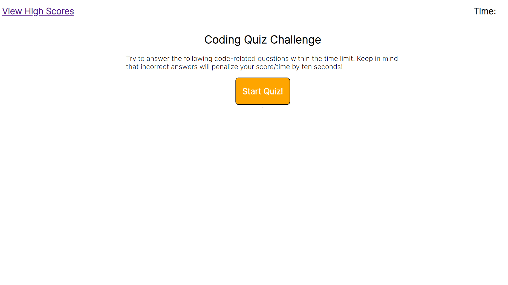

# Javascript Quiz

## Description

This quiz challenges the player to answer all the questions within the time limit. The time left at the end is their score, which they can submit to the leaderboard and view past runs. Incorrect answers knock 10 seconds off the clock.

## Usage

The code is designed to allow a user to easily add question and answer sets as objects.

Screenshot here:

To play, click the link below.

https://codeclass0.github.io/javascript-practice-quiz/